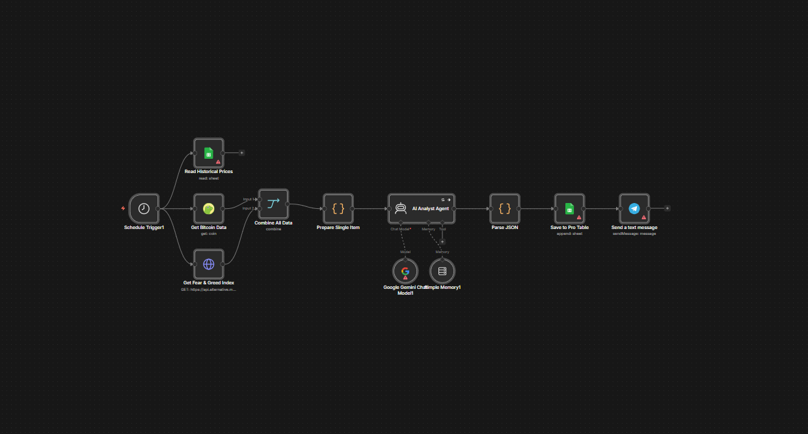

# 📊 CryptoMind AI FREE Lite: Бесплатная аналитическая станция институционального уровня

   

> **Хватит торговать на эмоциях. Начните принимать решения с умом — БЕСПЛАТНО.**



CryptoMind AI Lite — это высокопроизводительный **бесплатный воркфлоу n8n**, разработанный для работы в качестве вашего личного аналитического отдела 24/7. Объединяя рыночные данные в реальном времени с аналитическими возможностями **Google Gemini**, он отсеивает рыночный шум, предоставляя сигналы институционального уровня абсолютно бесплатно.

---

### ⚡ Краткий обзор логики
Вот пример внутренней структуры. Воркфлоу автоматически обрабатывает логирование данных и использует триггеры по расписанию для обеспечения непрерывного мониторинга рынка:

```json
{
  "name": "Save to Pro Table",
  "type": "n8n-nodes-base.googleSheets",
  "typeVersion": 4.5,
  "position": [1248, 192],
  "parameters": {
    "operation": "append",
    "documentId": {
      "__rl": true,
      "value": "1xd6erfNIH9EtMKRkNHiKuelQosqPL1AzwDTYRVatpWs",
      "mode": "id"
    },
    "sheetName": {
      "__rl": true,
      "value": "gid=0",
      "mode": "list"
    }
  }
}

```

### 🧠 Основной интеллект (Бесплатно)
* **Глубокий анализ настроений:** Многомодельная оценка психологии рынка с использованием нейросетей — абсолютно бесплатно.
* **Логика институционального уровня:** Продвинутые алгоритмы оценки, вычисляющие «уровень уверенности» (Confidence Score) для каждого сигнала.
* **Потоковые данные в реальном времени:** Простая интеграция с **[CoinGecko API](https://www.coingecko.com/en/api)** для высокоточного отслеживания цены и объема.
* **Практические оповещения:** Мгновенная **[доставка в Telegram](https://telegram.org/)** со структурированной аналитикой, включая настроения рынка и обоснование от ИИ.

### ⚙️ Технологический стек
* **Движок автоматизации:** [n8n](https://n8n.io/) (Self-hosted или Cloud).
* **ИИ-модель:** [Google Gemini Pro](https://ai.google.dev/) (Lite-версия).
* **Источники данных:** CoinGecko API и [Alternative.me](https://alternative.me/crypto/fear-and-greed-index/) (Индекс страха и жадности).

### 🚀 Быстрый старт
* **Стоимость:** $0 (Open-Source).
* **Время настройки:** Менее 5 минут — просто импортируйте JSON и добавьте свои API-ключи.

---

### 🛒 Как получить?
Этот проект полностью открытый (open-source). Вы можете бесплатно скачать воркфлоу, чтобы получить конкурентное преимущество на рынке уже сегодня.

👉 **[Скачать CryptoMind AI Lite БЕСПЛАТНО на Gumroad](https://naroka.gumroad.com/l/CryptoMindAIAutomatedMarketAnalystLite)**

---

### 🔥 Переход на версию Pro
Выведите свою торговлю на новый уровень с помощью инструментов институционального уровня:

🚀 **[CryptoMind AI Pro на GitHub](https://github.com/nar0ka/CryptoMind-AI-Pro)** — углубленный анализ рынка, интеграция с GPT-4o и продвинутые технические индикаторы для Bitcoin.

---

### 🌐 Оставайтесь на связи
Присоединяйтесь к нашему сообществу, чтобы быть в курсе новых Pro-версий, свежих воркфлоу и советов по автоматизации с помощью ИИ:

🐦 **[Подписывайтесь на Naroka Automation в X (Twitter)](https://x.com/nar0ka)**

💎 **[Следите за Naroka Studio на GitHub](https://github.com/nar0ka)**

---

## 🚀 Готовы делегировать рутину искусственному интеллекту?

Я разрабатываю **кастомные автоматизации и ИИ-ассистенты на базе n8n**, которые работают 24/7 и экономят десятки часов вашего времени. Я беру на себя весь процесс: от анализа ваших задач до внедрения готового решения «под ключ».

### Связаться со мной:

* 💬 **Telegram:** [t.me/nar00ka](https://t.me/nar00ka) — давайте обсудим вашу идею за 10 минут.
* 🐙 **GitHub:** https://github.com/nar0ka — изучите мои open-source проекты.
* 📦 **Gumroad:** https://naroka.gumroad.com — посмотрите готовые к использованию воркфлоу.
* <a href="https://wa.me/380632991898" target="_blank"></a>

> **💡 Бонус:** Если вы не уверены, с чего начать автоматизацию, просто напишите мне — я помогу определить, какие процессы можно оптимизировать уже сегодня!

---

*Разработано с 💎 от **[Naroka Studio](https://github.com/nar0ka)** — Создаем будущее автономных бизнес-движков.*
